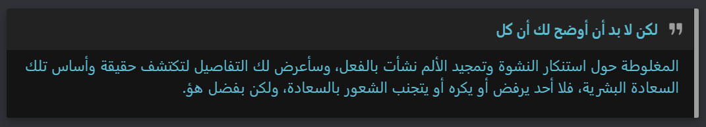
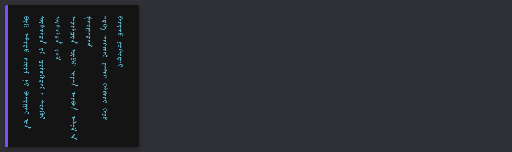
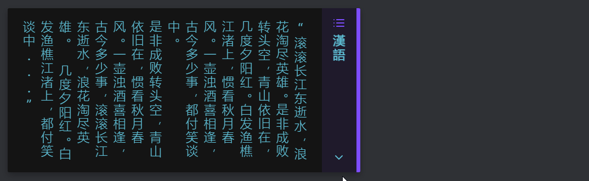

# Callout Typesetting
- [Introduction](#introduction)
- [Modifiers](#modifiers)
- [Style Settings](#style-settings)
- [Demos](#demos)
	- [rtl](#rtl)
	- [vertical-lr (and no-title)](#vertical-lr-and-no-title)
	- [vertical-rl](#vertical-rl)
	- [keep-height](#keep-height)

---
## Introduction
The [Callout Typesetting](CalloutTypesetting.css) snippet enables some composable inline formatting options that can be applied to your callouts. If you’re new to callouts, consider taking a peek at the documention for it on the [Obsidian website](https://help.obsidian.md/How+to/Use+callouts). The snippet uses a special attribute, `data-callout-metadata`, which gets its value from any string of text that you enter inside of a callout declaration that comes after a single pipe `|` character.  

For example, let’s say you have a `> [!quote]`  declared, and you want to change its formatting so that it can display some right-to-left text, such as putting some Arabic or Hebrew text into your otherwise English (and therefore left-to-right) notes. To do this, you can change the callout declaration to `> [!quote|rtl]`. Now, your quote’s text should display as if it the page were written in right-to-left-mode!  

---
## Modifiers
Modifiers can be chained together, such as `> [!example|vertical-lr no-title]` in the second example below. These modifiers can be in any order.  If a modifier of a given type is not included, the callout will try to use appropriate defaults. (Many defaults have not been given explicit modifiers to save on how much typing is needed to produce the desired callout formatting.)

Modifiers:
- Flow
	- **ltr**: Allows text to flow right-to-left.
	- **rtl**: Allows text to flow left-to-right.
	- **vertical-lr**: Allows vertically-oriented text whose lines flow left-to-right.
	- **vertical-rl**: Allows vertically-oriented text whose lines flow right-to-left.
- Glyph Orientation
	- **upright**: Displays *all* glyphs in an upright orientation.
	- **sideways**: Displays *all* gyphs in a sideways orientation.
- Title
	- **no-title**: Hides the title portion of any callout.
- Display
	- **l-align**: Aligns the entire callout to the left.
	- **r-align**: Aligns the entire callout to the right.
- Vertical Display
	- **wide**: Forces the callout to run the entire width of the page, or up to your Readable Line Length if that setting is enabled.
	- **keep-height**: Forces the callout to keep its vertical height when collapsed the same as its vertical height when expanded.

---
## Style Settings
The snippet includes an implementation of a few adjustable values using the [Style Settings](https://github.com/mgmeyers/obsidian-style-settings) plugin by mgmeyers. The following settings (mostly for vertical callouts) are available:
- **Max Line Height**: The maximum height in pixels of `vertical-lr` and `vertical-rl` callouts. Default 300px.
- **Title Flex Gap**: The size of vertical gaps between elements contained in vertical callout titles, in pixels. Default 5px.
- **Glyph Spacing**: The size of the vertical spacing between individual glyphs in vertical callouts, in [em](https://developer.mozilla.org/en-US/docs/Learn/CSS/Building_blocks/Values_and_units#relative_length_units). Default 0.125em.
- **Vertical Padding**: The size of the vertical padding between a vertical callout's edges and its content, in [em](https://developer.mozilla.org/en-US/docs/Learn/CSS/Building_blocks/Values_and_units#relative_length_units). Default 1em.

---
## Demos
Click any of the header links to see the associated written Markdown.
### |[rtl](Examples/rtl.md)

### |[vertical-lr](Examples/vertical-lr.md) (and no-title)

### |[vertical-rl](Examples/vertical-rl.md)

### |[keep-height](Examples/keep-height.md)

