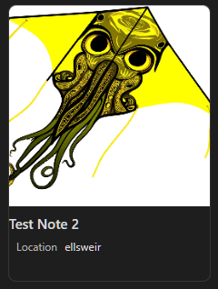

# Multi Image Cards



This is a small snippet for the Cards View feature Obsidian's new Bases feature. For a quick overview of how the core feature works, please take a gander at the Obsidian helpsite's documentation for [syntax](<https://help.obsidian.md/bases/syntax>), [functions](<https://help.obsidian.md/bases/functions>), and [views](<https://help.obsidian.md/bases/views>) respectively. This document assumes that you have read those, and have a cursory understanding of them.  

First things first, download the snippet [here](MultiImageCards.css). If you need help with that, the Obsidian helpsite once again has a nice page on [CSS snippets](<https://help.obsidian.md/snippets>).  

## View Setup

Suppose we have a Base with a View configured like so:  

```yaml
views:
  - type: cards
    name: A View
    order:
      - file.name
      - formula.images
    sort:
    image: '#000'
```

In the context of the snippet, the thing that matters most is that there is, somewhere within its list of displayed properties, `formula.images`. i also recommend, for many reasons, putting that as the last thing in your View's displayed property order. By default, this is what the snippet uses to attempt to identify the necessary things to pull when emulating the appearance of multiple images on the card. If you are comfortable with CSS, you can change that value to something different (both in the snippet and in any Base Views that use it, as long as you remember whatever it is that you want to call the formula property.  

To provide the list of images that we want the snippet to use from each card, all we do is create a formula, give it the name `images` (or whatever you prefer as explained above), and then define or calculate something that will return a list of images. The list should be a flat list and it should only contain images, such as with the [image()](<https://help.obsidian.md/bases/functions#%60image()%60>) function. For example, you might have some property (let's call it `yourProp`) with a list of links in it. That might look something like this:

```yaml
---
# ...pretend rest of Frontmatter above...

yourProp: 
  - "[[funny kite image.png]]"
  - "[[a Gemmy.jpg]]"
  - "[[Placeholder.png]]"

# ...maybe some more Frontmatter after...
---
```

and then you could have your formula's value be:  

```yaml
formulas:
  images: yourProp.map(image(value))
```

There are many other ways by which you could contrive a list of images syntactically, but this is likely a realistic example for many users who put such things in their Properties.
