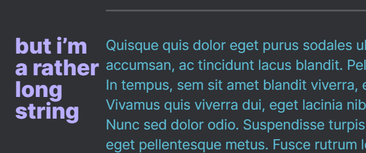

# Scroll Header Callout

⚠ Warning, this WILL break header references to contained headers! This can be partially remedied by creating a block reference to the entire callout. Other behavior related to snippets or plugins may change as a result of using this snippet. Be prepared and always make good, retrievable backups. ⚠

This is a CSS [snippet](ScrollHeadings.css) that adds a custom callout to Obsidian. It will style any heading on the first line of the callout's content to appear as a title to the left of the main body. This snippet is intended for use with Readable Line Length enabled. Additionally, it is intended primarily for use with Source Mode, though some Live Preview functionality is supported.  

The snippet includes an implementation for the [Style Settings](https://github.com/mgmeyers/obsidian-style-settings) plugin.  

---
## Demo
A demo using the [Example.md](Example.md) file.  

