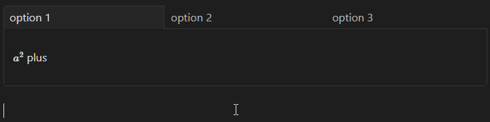

# Mostly-CSS Tabs in Obsidian

This is an implementation for a tab-based rendering scheme in Obsidian.md, leaning heavily on capabilities offered by the native callouts feature of the app. The snippet is available in this repository or at [this link](TabsInObsidian.css). We use mostly CSS and a very minor amount of code for the [Meta Bind](<https://obsidian.md/plugins?id=obsidian-meta-bind-plugin>) community plugin to get everything working properly. To get started, you'll want to be familiar with the [basic syntax of callouts](https://help.obsidian.md/How+to/Use+callouts), and Meta Bind's [select](<https://www.moritzjung.dev/obsidian-meta-bind-plugin-docs/reference/inputfields/select/>) input fields.  



## The Meta Bind

For everything to function, we need a way to consistently manage the state of some kind of element in the DOM of our page, to then use as a hinge on which to apply CSS to our callouts and create the illusion of a functional tabbed component. The Meta Bind plugin provides a convenient way to do this. i will not go deep into a full explanation of Meta Bind, but i *will* explain a basic example, such as the below.

```md
~~~meta-bind
INPUT[select(
option(1, option 1),
option(2, option 2),
option(3, option 3),
class(tabbed)
)]
~~~
```

Without getting too deep into what all this means, there are a few bits to be cognizant of:  

- As written, you should attempt to use a `select` input field in all situations, preferring the codeblock format as demonstrated above. (Yes, the triple tilde `~~~` is valid Markdown and will work in Obsidian; easy to copy and paste in Discord, too.)
- All labels used in the tabs will be explicitly determined by the text passed in the second argument of each `option()` in the input field.
- You must absolutely include the `class(tabbed)` argument, as this is what allows our snippet to only select the fields that we want to style and not affect others that you may use elsewhere in your notes with Meta Bind.

## The Callouts
We will be using two types of callout to help us with structure, and a third type to hold our desired content:

- `[!tabbed-box]` is the outermost callout and will serve as a container for any tabs and content that you want to have grouped together.
- `[!div-m]` is a custom inner callout from the [Chassis Callouts](../ChassisCallouts/chassis_callouts.css) snippet that i use to remove most default styling and act as something of an arbitrary div, but you can use any inner callouts that you prefer. The actual content that you want to have exist for each virtual tab will be in the callout content of *these* (inner) callouts.  

The basic structure inside the actual note will look something like this:  

```md
>[!tabbed-box]
> >[!div]
> >
> > $a^2$ plus
>
> > [!div]
> > 
> > $b^2$ equals
> 
> > [!div]
> > 
> > $\frac{E}{m}$
```

Overall, there's nothing too complex here from a callouts perspective, just a lot of nesting which can be somewhat uncomfortable sometimes. Protip: you can write the things you want to put in each layer of the callout *first*, and then select all of those things and use `Ctrl+P -> Insert callout` to wrap them up automatically. If you start at the deepest branches and work your way back up to the top, it's a pretty convenient way to get those fancy infoboxes and the like in working order.  

And that's really all that we need on the callout side. If you want a full demo to read through, check out [example.md](example.md).  

## Putting it together

Finally all we have to do is plaster these two blocks directly on top of each other:

```md
~~~meta-bind
INPUT[select(
option(1, option 1),
option(2, option 2),
option(3, option 3),
class(tabbed)
)]
~~~
>[!tabbed-box]
> >[!div]
> >
> > $a^2$ plus
>
> > [!div]
> > 
> > $b^2$ equals
> 
> > [!div]
> > 
> > $\frac{E}{m}$
```

## Live Preview

i would like to warn ahead of time about a small incongruency that can sometimes pop up if you are particularly ambitious with using nested callouts. Normal use of the Markdown structure offered above will function perfectly well in Live Preview, and that is in fact one of many reasons that we use Meta Bind for this solution in the first place. *However*, if you put a tab setup *inside* of another callout in Live Preview, clicking on it automatically passes through the click event down to the editor, which means the *outer* callout will cease to be rendered along with everything inside of it. To my knowledge, this cannot be prevented in vanilla Obsidian, and as of Obsidian v1.5.12 and 2024-04-30, i am not aware of any plugins that can intervene and prevent it. In all other respects, things should work in both Live Preview and Reading View.